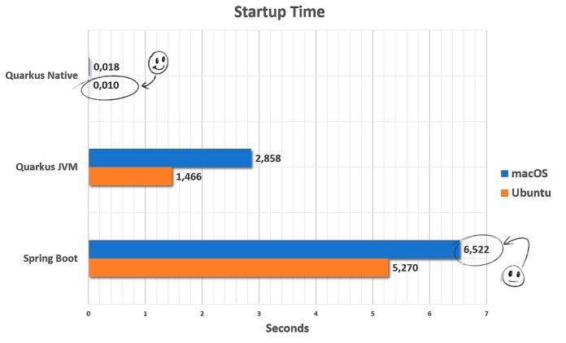
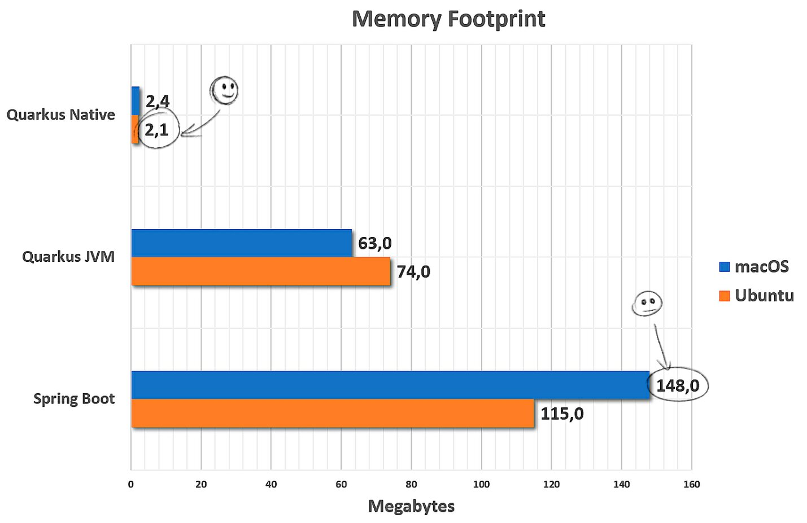
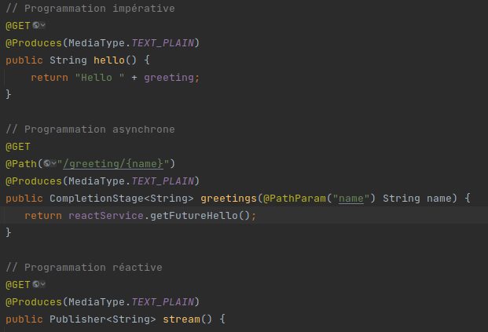

# quarkus-sand-box Project

## Quarkus c'est quoi ?

- _Le site du projet : https://quarkus.io/_
- _Le github du projet : https://github.com/quarkusio/quarkus_

Quarkus est un framework Java, conçu pour les machines virtuelles Java (JVM) et la compilation native.

Il tente de répondre aux problèmes liés à Java et son utilisation dans le Cloud, en concevant des applications 
légères (**subatomic**) au démarrage rapide (**supersonic**).

Il permet de **réduire d’environ 99% le temps de boot et d’environ 86% l’empreinte mémoire des applications** Java 
classiques en utilisant la compilation native proposée par GraalVM.

<p align="center">
    
</p>

<p align="center">
    
</p>

Cette amélioration à cependant des désavantages : 
- **une augmentation du temps de la phase de build** non négligeable pour du natif. 
- Certaines **fonctionnalités ne sont pas disponibles** en exécution native, par exemple, Reflection et Java Native Interface (JNI).
  Pour plus d'infos voir https://github.com/oracle/graal/blob/master/docs/reference-manual/native-image/Limitations.md

## Des extensions ?

Plus de 90 extensions Quarkus sont disponibles et couvrent la plupart des fonctionnalités requises pour créer des applications Cloud natives :

- Web : RESTEasy JAX-RS/JSON-B, GraphQL, OpenAPI avec Swagger-UI, RESTEasy Qute…
- Données : Hibernate, JDBC, MongoDB, Neo4j, Liquibase…
- Messages asynchrones : Kafka, AMQP…
- Reactive : Vert.x, Mutiny, Reactive client (DB2, MySQL, PostgreSQL)…
- Cloud : Health, Fault Tolerance, Kubernetes, OpenShit, Amazon, Minikube…
- Observabilité : Metrics & OpenTracing par SmallRye
- Sécurité : OpenID, JSON Web Token, OAuth 2.0, Keycloak, Vault
- Intégration avec Apache Camel

Egalement une nouvelle extension « **Hibernate ORM with Panache** » simplifie l’accès à la couche de persistance en utilisant 
le design pattern Active Record sur l’entité JPA.

Une compatibilité est également possible avec l’écosystème Spring (Spring Boot, Spring Security, Spring Web, Spring Data JPA, Spring DI).
Quarkus offrant des extensions pour convertir le code Spring en code natif.

Certaines fonctionnalités sont néanmoins incompatibles :
- Le support de Spring dans Quarkus ne démarre pas le contexte. 
- Les classes et annotations Spring ne sont utilisées que pour lire les métadonnées et/ou sont utilisées comme types 
- de retour de méthodes dans le code ou de types de paramètres. Ceci implique que l’ajout d’autres librairies Spring n’aura aucun effet. 
- Les classes d’infrastructure Spring (comme org.springframework.beans.factory.config.BeanPostProcessor par exemple) ne seront pas exécutées.

## Livereload

Quarkus fait également renaître une fonctionnalité qui avait plus ou moins disparu avec l’arrivée de Spring Boot : le livereload.

Basé sur le plugin Maven io.quarkus:quarkus-maven-plugin (ou équivalent sous Gradle), la simple commande `mvn compile quarkus:dev` 
permet de lancer l’application Java en mode développement et de coder en direct sans avoir à relancer/déployer son application.

## Unification de la programmation impérative et réactive

Le modèle de développement de Quarkus se transforme pour s’adapter au type des applications que vous développez,
le framework permet d’unifier la programmation impérative et réactive.

Le développeur Java pourra ainsi dans ses services standards JAX-RS développer avec une seule API des microservices HTTP, 
des applications réactives et des applications message-driven ; seule la réponse change : trois paradigmes, une seule implémentation.

<p align="center">
    
</p>


## Création d'un projet

Il est possible de créer le squelette d'une nouvelle application grâce à une interface web : [https://code.quarkus.io/](https://code.quarkus.io/)

---

This project uses Quarkus, the Supersonic Subatomic Java Framework.

If you want to learn more about Quarkus, please visit its website: https://quarkus.io/ .

## Running the application in dev mode

You can run your application in dev mode that enables live coding using:

```shell script
./mvnw compile quarkus:dev
```

> **_NOTE:_**  Quarkus now ships with a Dev UI, which is available in dev mode only at http://localhost:8080/q/dev/.

## Packaging and running the application

The application can be packaged using:

```shell script
./mvnw package
```

It produces the `quarkus-run.jar` file in the `target/quarkus-app/` directory. Be aware that it’s not an _über-jar_ as
the dependencies are copied into the `target/quarkus-app/lib/` directory.

The application is now runnable using `java -jar target/quarkus-app/quarkus-run.jar`.

If you want to build an _über-jar_, execute the following command:

```shell script
./mvnw package -Dquarkus.package.type=uber-jar
```

The application, packaged as an _über-jar_, is now runnable using `java -jar target/*-runner.jar`.

## Creating a native executable

You can create a native executable using:

```shell script
./mvnw package -Pnative
```

Or, if you don't have GraalVM installed, you can run the native executable build in a container using:

```shell script
./mvnw package -Pnative -Dquarkus.native.container-build=true
```

You can then execute your native executable with: `./target/quarkus-sand-box-1.0-SNAPSHOT-runner`

If you want to learn more about building native executables, please consult https://quarkus.io/guides/maven-tooling.html
.

## Related Guides

- RESTEasy JAX-RS ([guide](https://quarkus.io/guides/rest-json)): REST endpoint framework implementing JAX-RS and more

## Provided Code

### RESTEasy JAX-RS

Easily start your RESTful Web Services

[Related guide section...](https://quarkus.io/guides/getting-started#the-jax-rs-resources)
